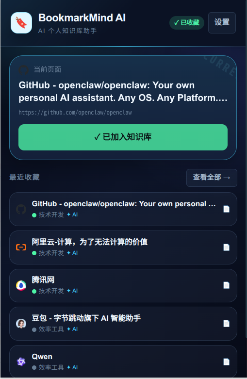
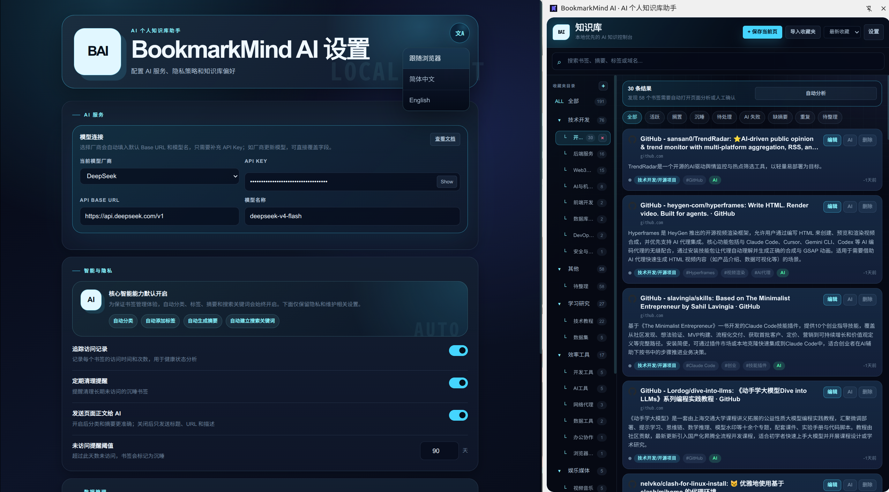

# BookmarkMind AI

**Local-first AI Bookmark Manager & Personal Knowledge Assistant**

BookmarkMind AI 是一款面向 Chrome / Edge 的本地优先书签管理扩展。它会在你保存网页时自动提取标题、URL、描述和可读正文，并结合本地规则与 OpenAI-compatible 模型，生成摘要、标签、关键词和稳定的两级目录，把“收藏夹”升级成可检索、可回顾、可持续整理的个人知识库。

> 让收藏夹不只是存链接，而是沉淀知识。

## 界面预览

### Popup：一键收藏当前页面



### 设置页与知识库侧边栏



## 项目定位

传统收藏夹最大的问题不是“保存不了”，而是“保存之后很难持续整理”：

- 收藏动作很轻，但后续整理成本很高。
- 老收藏夹目录命名混乱，导入后往往越积越乱。
- 浏览器原生搜索主要依赖标题和 URL，很难按摘要、标签、主题和领域找回内容。

BookmarkMind AI 当前采用 `local-first + BYOK` 模式：

- 书签主体保存在浏览器本地 `IndexedDB`。
- 设置、目录、导入进度、用户学习记录等轻量状态保存在 `chrome.storage.local`。
- 用户使用自己的 OpenAI-compatible API Key，不依赖项目服务器额度。
- API Key 只保存在本地浏览器环境中。
- 基于 Chromium Manifest V3，支持 Chrome 与 Microsoft Edge。

## 当前版本能力

### 1. 收藏与内容提取

- Popup 中一键保存当前页面。
- 支持右键菜单：
  - `保存并整理此页面`
  - `打开 BookmarkMind AI 面板`
- 支持快捷键：
  - `Alt+B`：打开 Popup
  - `Alt+Shift+S`：保存当前页面并触发 AI 整理
  - `Alt+Shift+M`：打开侧边栏
- 自动提取标题、URL、描述、正文、favicon、OG 图片等页面信息。
- 内容脚本不可用时会自动降级提取，优先保证书签可以先保存成功。

### 2. AI 自动整理

- 自动分类到固定的两级目录体系。
- 自动生成标签、摘要、关键词。
- 支持是否将页面正文发送给模型，可只用标题、URL、描述做轻量分析。
- AI 处理在后台异步执行，不阻塞收藏动作。
- 对相同页面的 AI 请求做了去重和节流，避免重复调用。

### 3. 知识库侧边栏

- Side Panel 作为主知识库界面，支持常驻管理。
- 支持目录筛选、状态筛选、排序、搜索。
- 支持编辑目录、子目录、标签、备注。
- 支持单条重新分析失败书签。
- 支持查看 AI 状态：处理中、跳过、失败、已完成但缺摘要。

### 4. 搜索、体检与治理

- 本地加权搜索会综合标题、域名、URL、目录、标签、关键词、摘要、备注进行排序。
- 内置常见主题词扩展，例如 `VPN`、`Web3`、`AI`、`数据库`、`设计` 等同义召回。
- 提供 `待处理`、`AI 失败`、`缺摘要`、`重复`、`待整理` 等体检视图。
- 支持按规范化 URL 清理重复书签，并优先保留信息更完整的记录。
- 支持清理没有任何书签的自定义空目录。

### 5. 导入、导出与迁移

- 支持导入浏览器书签 HTML。
- 支持导入 BookmarkMind AI 导出的 JSON。
- 支持导出为 JSON / Markdown / HTML。
- 导入旧收藏夹时不会直接沿用原始混乱目录，而是统一先进入 `其他 / 待整理`。
- 原始导入目录会保存在 `sourceFolderPath` 中，作为后续分类上下文，但不会直接污染展示目录树。
- 导入后会逐页自动分析，并在侧边栏展示处理进度与失败数量。

### 6. 本地优先与书签健康

- 自动记录访问时间与访问次数。
- 每日后台任务会更新书签状态：`active`、`idle`、`sleeping`。
- 设置页支持访问跟踪、清理提醒、隐私开关、语言切换、数据清空。
- 支持简体中文与英文界面。

## 智能分类策略

BookmarkMind AI 不是“完全自由生成目录”，而是采用“稳定目录体系 + 本地规则 + AI 判别 + 用户纠偏学习”的组合方案。

### 固定两级目录体系

当前内置 11 个一级目录，二级目录用于表达更细的主题：

- 技术开发
- 产品设计
- 学习研究
- 效率工具
- 资讯动态
- 工作资料
- 商业财经
- 医疗健康
- 生活消费
- 娱乐媒体
- 其他

这样做的原因是：书签目录需要长期稳定，而标签更适合承担横向检索和细粒度表达。

### 四阶段分类流水线

代码中的分类器目前采用以下流程：

1. 域名映射：高置信度识别常见站点与平台。
2. URL / 规则分析：结合标题、域名、正文关键词与内容类型做本地判断。
3. AI 语义分类：调用用户配置的 OpenAI-compatible 模型。
4. 融合输出：综合本地规则与 AI 结果，得到最终目录、标签和置信度。

### 用户纠偏学习

- 当用户手动把书签移动到其他目录时，系统会记录这次修正。
- 同域名多次修正后，后续相似页面会优先参考用户偏好。
- 这部分学习记录同样保存在本地，不依赖云端。

## 处理流程

1. 用户通过 Popup、快捷键或右键菜单保存当前页面。
2. Content Script 提取页面标题、描述、正文等上下文。
3. Background Service Worker 先落库，再异步触发分类、摘要和关键词提取。
4. Side Panel 实时接收更新，展示处理状态、进度与结果。
5. 用户可继续编辑目录、标签、备注，系统再把这些修正反馈给本地学习模块。

## AI Provider 支持

当前内置了多个 OpenAI-compatible Provider 预设，切换时会自动带出默认 `Base URL` 和模型名：

- DeepSeek
- Kimi
- OpenAI
- NVIDIA NIM
- OpenRouter
- SiliconFlow
- 通义千问 DashScope
- 火山方舟
- 智谱 BigModel
- Groq
- Together AI
- Perplexity
- Custom OpenAI-compatible API

当前版本的特点是：

- 没有项目侧 AI 配额。
- 没有账号绑定要求。
- 由用户自行承担模型调用费用。

## 数据与隐私

### 数据存储

- `IndexedDB`：书签主体、摘要、标签、关键词、同步预留字段等大体积数据。
- `chrome.storage.local`：设置、目录、导入任务、语言、用户学习记录等轻量数据。

### 隐私原则

- API Key 仅保存在本地。
- 项目当前没有自建后端参与数据中转。
- 当 `sendContentToAI` 开启时，页面正文会发送给用户选择的模型服务商。
- 当 `sendContentToAI` 关闭时，主要发送标题、URL 与描述，隐私暴露面更小，但摘要与分类准确率可能下降。

### 为未来云同步预留的字段

当前数据模型已经预留了以下同步字段：

- `remoteId`
- `syncState`
- `syncVersion`
- `syncUpdatedAt`
- `deletedAt`

删除书签时使用 tombstone 方案而不是立即物理删除，这样后续可以更平滑地接入增量同步、多设备合并和冲突处理。

## 当前边界与注意事项

- 当前只能对可访问的 `http/https` 页面做完整分析。
- `chrome://`、扩展页、部分登录页、强限制页面可能无法提取到可摘要正文。
- 即使 AI 未配置，书签仍然可以保存；但会跳过摘要、标签、关键词和自动整理流程。
- 导入大量旧收藏夹后，后台会顺序打开页面做分析，因此处理时间会随数量增长。

## 技术架构

### 技术栈

- React 19
- TypeScript
- Vite
- Chrome Extension Manifest V3
- Chrome Side Panel API
- IndexedDB
- Chrome Storage Local

### 目录结构

```text
src/
  background/   Service Worker，负责消息处理、AI 调度、导入进度、状态更新
  content/      页面内容提取脚本
  popup/        快速收藏入口
  sidepanel/    知识库主界面
  options/      模型配置、隐私设置、导入导出、数据管理
  lib/          AI 服务、分类器、存储层、导入导出、国际化
  styles/       设计系统样式
  types/        核心类型定义
public/         扩展图标与本地化文案
doc/img/        README 演示图片
```

## 开发与本地安装

### 安装依赖

```bash
npm install
```

### 本地开发

```bash
npm run dev
```

### 构建扩展

```bash
npm run build
```

构建完成后，产物位于 `dist/` 目录。

### 代码检查

```bash
npm run lint
npm run build
```

### 加载到 Chrome / Edge

1. 运行 `npm run build`。
2. 打开 `chrome://extensions` 或 `edge://extensions`。
3. 开启开发者模式。
4. 点击 `Load unpacked`。
5. 选择项目下的 `dist/` 目录。

## 使用流程

1. 打开设置页，选择 AI Provider 并填写 API Key。
2. 通过 Popup、快捷键或右键菜单保存当前网页。
3. 等待后台自动生成目录、标签、摘要和关键词。
4. 在侧边栏中搜索、筛选、编辑与整理书签。
5. 如需迁移旧收藏夹，导入浏览器导出的 HTML 文件即可。

## 权限说明

扩展当前使用的核心权限包括：

- `storage` / `bookmarks`：保存设置与管理书签数据。
- `activeTab` / `tabs` / `scripting`：读取当前页面内容并在导入后自动打开页面分析。
- `sidePanel`：提供主知识库界面。
- `contextMenus`：提供右键保存与打开面板入口。
- `notifications`：保存完成后给出轻提示。
- `alarms`：执行每日书签健康状态更新。

## 迭代方向

### 近期会继续打磨的本地模式

- 更完整的“书签体检”体验，包括失败补处理、缺摘要修复和待整理回收。
- 更细的目录治理，例如低频目录合并建议、非规范目录修正建议。
- 更好的沉睡书签分析与 AI 归档建议。
- 更稳定的搜索排序与知识卡片编辑体验。

### 已经为后续云能力做好的准备

- 现有数据模型已预留同步版本号、远端 ID 和删除 tombstone。
- 后续可以在此基础上接入账号体系、云端同步、多设备知识库和备份恢复。
- 同步层更适合做成三层结构：本地仓储层、同步队列层、云端 API 层。

### 商业化与服务模式的自然延伸

- 在当前 BYOK 之外提供官方托管 AI 服务。
- 为免费用户提供有限额度，为付费用户提供更完整的自动整理能力。
- 在需要付费、同步、多设备访问时引入登录体系。

## 适合谁

- 收藏夹已经很多，但整理成本越来越高的人。
- 想把技术资料、教程、工具和行业信息沉淀成知识库的人。
- 希望自己掌握模型选择、费用和数据边界的用户。

## License

当前仓库未声明开源许可证。如需公开发布，建议补充明确的 License、隐私政策与商店说明文案。
